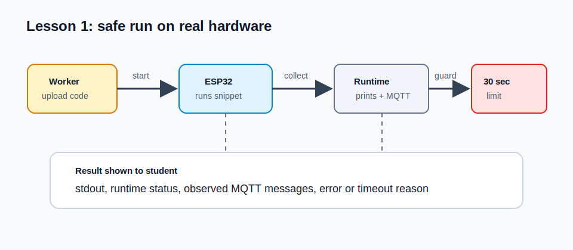

# Lesson 1: 30-Second MQTT Sandbox

## Lesson objective
Run a tiny MicroPython program on the ESP32 and see what the board prints or publishes.


## Introduction
This sandbox is for trying code safely before writing a strict lesson solution.
Your program can print text and, if you want, publish MQTT messages. The checker
will run it for up to 30 seconds.

## Lab architecture
Your code runs on a real ESP32 board, not in a browser simulator. The lab worker
uploads your MicroPython file to the board, asks the firmware to run it, and then
collects output from the board. Printed lines are sent back through the board's
runtime channel so the checker can show what happened.

The 30-second limit protects the shared hardware. If a program waits forever, the
worker can stop waiting and keep the board available for the next attempt.



## MQTT concepts
MQTT is a lightweight message system used by many IoT devices. A device connects
to a broker, publishes messages to topics, and can subscribe to topics to receive
messages. You do not need MQTT for the first print-only sandbox, but the optional
example shows the same connection pattern used later in the course.

## Assignment
Write a short program that prints one line.

Example:

```python
print("Hello from ESP32")
```

Optional MQTT test:

```python
import json

client = make_mqtt_client()
topic = ATTEMPT_TOPIC_ROOT + "/telemetry"

client.connect()
client.publish(topic.encode(), json.dumps({"name": "sandbox", "value": 1}).encode())
client.disconnect()
```

## Notes
- The sandbox is not about perfect code. It is for testing.
- The program must not need more than 30 seconds.
- If your program waits for messages, use a limited loop such as `for _ in range(30)`.

## Conclusion
You can now run small snippets on the real board and inspect the result.
