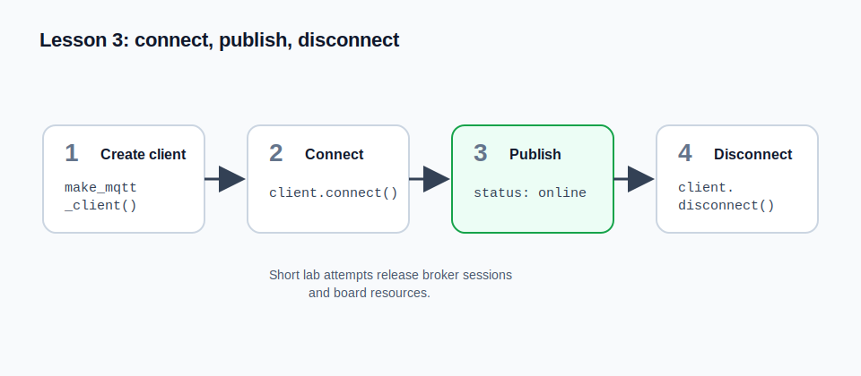

# Lesson 3: Connect, Publish, Disconnect

## Lesson objective
Practice the complete short MQTT lifecycle.


## Introduction
Short MQTT programs should open the connection, do their work, and close the
connection. This makes tests predictable and keeps the board ready for the next
attempt.

## Lab architecture
The ESP32 is a shared lab device. Each attempt runs as a short program on the
board. A clean `disconnect()` tells the broker that this client session is done
and helps the worker distinguish a completed attempt from code that is still
running or stuck.



## MQTT concepts
The basic MQTT lifecycle is:

1. create a client
2. connect to the broker
3. publish or subscribe
4. disconnect when finished

This pattern is important in embedded systems because network sockets, memory,
and broker sessions are limited resources. Short tasks should release them as
soon as possible.

The lab uses MicroPython's `umqtt.simple` client underneath the helper
`make_mqtt_client()`. The helper already knows the broker address, credentials,
and client id for your attempt, so your code can focus on the normal MQTT calls:
`connect()`, `publish(...)`, `subscribe(...)`, `check_msg()`, and
`disconnect()`.

## Assignment
Write a program that:

- creates an MQTT client with `make_mqtt_client()`
- calls `connect()`
- publishes one online telemetry message
- calls `disconnect()`

Required telemetry topic:

- `ATTEMPT_TOPIC_ROOT + "/telemetry"`

Required payload:

```json
{
  "name": "status",
  "value": "online"
}
```

## Notes
- Use `json.dumps(...)` to create the payload.
- Encode strings before publishing if your client requires bytes.
- Start from the template from the previous assignment: keep the same
  `make_mqtt_client()`, telemetry topic, `connect()`, `publish(...)`, and
  `disconnect()` shape, then change only the payload required here.
- This task should finish quickly.

## Conclusion
You can now write a complete small MQTT program from start to finish.
